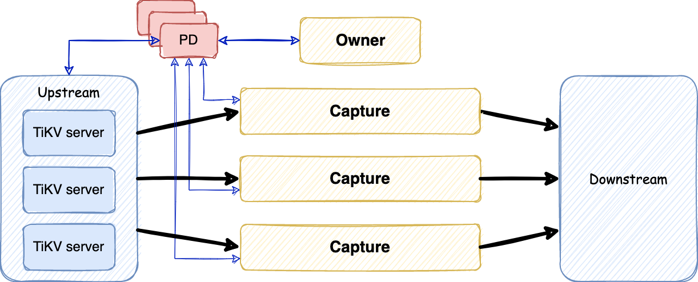

# TiKV-CDC

[](https://github.com/tikv/migration/actions/workflows/ci-cdc.yml)
[](https://app.codecov.io/gh/tikv/migration/tree/main/cdc)
[](https://github.com/tikv/migration/blob/main/cdc/LICENSE)
[](https://goreportcard.com/report/github.com/tikv/migration/cdc)

**TiKV-CDC** is [TiKV](https://docs.pingcap.com/tidb/dev/tikv-overview)'s change data capture framework. It supports replicating change data to another TiKV cluster.

TiKV-CDC is a fork of [TiCDC](https://github.com/pingcap/tiflow/blob/master/README_TiCDC.md), but focus on NoSQL scenario that uses TiKV as a Key-Value storage. By now, it can be used by RawKV to build a storage system with Cross Cluster Replication, to provide financial-level disaster recovery capabilities.

Please note that the minimal required version of TiKV is `v6.2.0`.

## Architecture



## Documentation

- [English](https://tikv.org/docs/latest/concepts/explore-tikv-features/cdc/cdc/)
- [中文](https://tikv.org/docs/latest/concepts/explore-tikv-features/cdc/cdc-cn/)

## Building

To check the source code, run test cases and build binaries, you can simply run:

```
$ make dev
$ make cdc
```

## Contributing

Contributions are welcomed and greatly appreciated. See [CONTRIBUTING.md](./CONTRIBUTING.md)
for details on submitting patches and the contribution workflow.

## License

TiKV-CDC is under the Apache 2.0 license. See the [LICENSE](./LICENSE) file for details.
